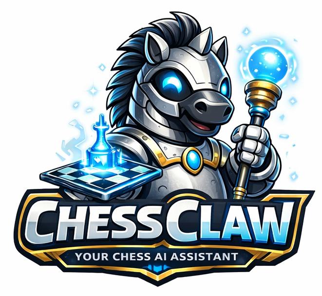
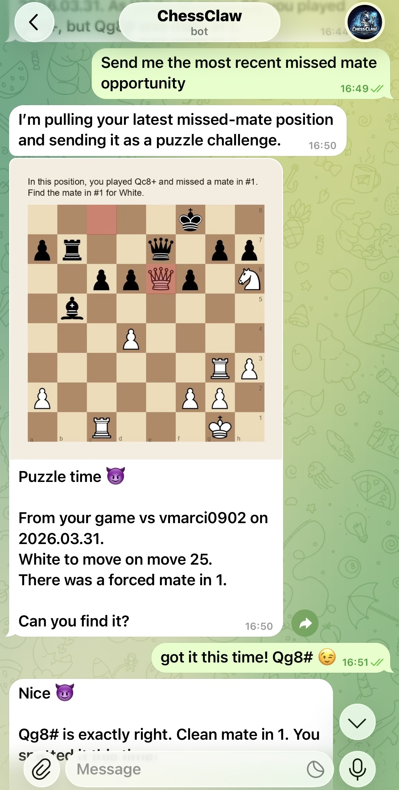
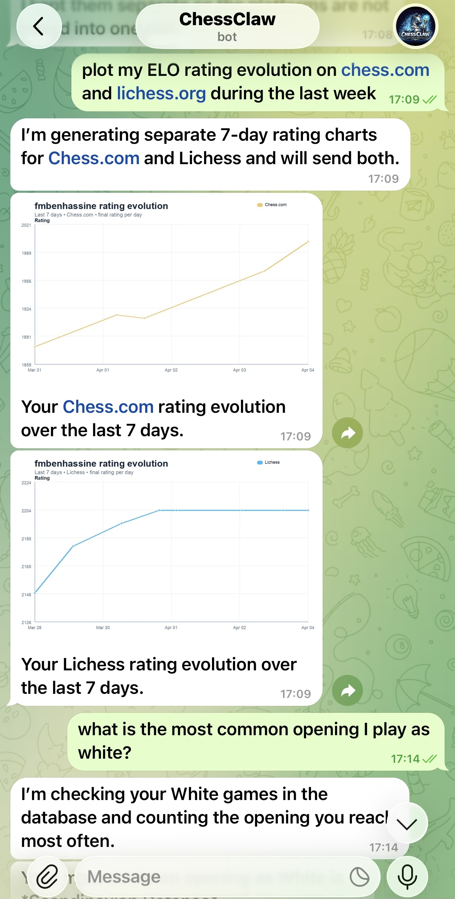
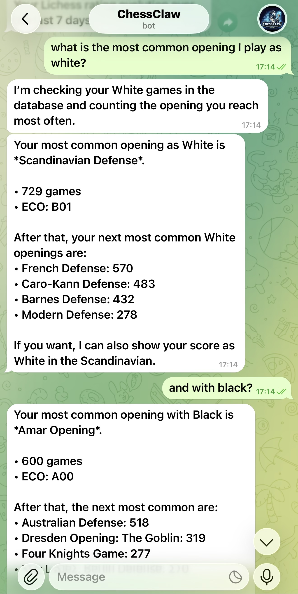

<p align="center">
  
</p>

<p align="center">
  Your personal chess AI assistant, running securely in containers.
</p>

## Why I Built This

I play chess on Lichess.org and Chess.com, and I found myself repeatedly asking for insights on my games, trying to track my progress, and juggling chess-related tasks across multiple platforms.
I wanted a more streamlined way to manage all of that without bouncing between tools, so I built ChessClaw: a personal chess assistant that brings everything together in one place:

- Watch my games on Lichess.org and Chess.com and aggregate them into a single database
- Analyze my games automatically, so I do not have to request analysis one game at a time
- Send me puzzles from my own games, either on demand or on a schedule
- Answer questions about my games in natural language
- Help me manage chess-related tasks, like scheduling training sessions or finding events in my area

Here are some examples of how I use ChessClaw:

<p align="center">
  
  
  
</p>


## Quick Start

```bash
git clone https://github.com/fmbenhassine/chessclaw.git
cd chessclaw
codex # or any other ai coding agent that can run SKILL.md files
```

Then run `/skills` and choose the `Setup ChessClaw` skill. Codex will walk you through dependencies, Telegram bot setup, container setup, and service configuration.

ChessClaw currently runs well with Codex, but the project is not tightly coupled to it. See [docs/AGENT_PLUGGABILITY.md](docs/AGENT_PLUGGABILITY.md) for the current pluggability boundary and the minimum refactor needed to swap the agent layer later.

> [!TIP] 
> You can still use Codex *without* a ChatGPT subscription by configuring it to run against OSS or other local providers. See the OpenAI docs on OSS mode and local providers: https://developers.openai.com/codex/config-advanced#oss-mode-local-providers

## Philosophy

ChessClaw started as a fork of [NanoClaw](https://github.com/qwibitai/nanoclaw). It was the closest agent framework to what I wanted, but it still included features I did not need for my use case, such as per-group workspaces and multiple communication channels.
So I forked it and stripped it down to the essentials: a containerized Codex assistant behind a Node gateway, accessible through a Telegram bot.

Therefore, the philosophy of the project is the same as NanoClaw's, but simplified even further and focused on a single use case:

**Small enough to understand.** One process, a few source files. No microservices, no message queues, no abstraction layers. Have Codex walk you through it.

**Secure by isolation.** Agents run in Apple Containers (or Docker containers). They can only see what's explicitly mounted, and they can only call MCP tools sitting in front of trusted scripts running on the host. Bash access is safe because commands run inside the container, not on your host.

**Built for one user.** This is not a framework. It is working software shaped around my exact needs. You fork it and have Codex customize it for yours.

**Customization = code changes.** No configuration sprawl. Want different behavior? Modify the code. The codebase is small enough that this is safe.

**AI-native.** No installation wizard; Codex guides setup. No monitoring dashboard; ask Codex what's happening. No debugging tools; describe the problem, Codex fixes it.

**Skills over features.** Contributors shouldn't add parallel transports to the codebase. Instead, they contribute skill workflows (for example `/add-whatsapp`) that transform your fork. You end up with clean code that does exactly what you need.

**Best harness, best model.** This runs on the Codex SDK, which means you are running Codex directly inside an isolated container harness.

## What It Supports

- **Telegram I/O** - Message ChessClaw from your phone
- **Single chat channel** - One Telegram chat is configured as the assistant channel
- **Single assistant workspace** - One `assistant/AGENTS.md` file and one persistent assistant filesystem
- **Scheduled tasks** - Recurring jobs that run Codex and can message you back
- **Container isolation** - Agents sandboxed in Apple Containers with mounted directories for persistent state and file access
- **Task decomposition** - Codex can break complex requests into executable steps with tool usage and MCP integrations
- **Optional integrations** - Add WhatsApp (`/add-whatsapp`) and more via skills

## Usage

Just talk to your assistant through the ChessClaw Telegram bot. Ask it to analyze your games, send you puzzles, give you insights, and manage your chess-related tasks.

## Customizing

There are no configuration files to learn. Just tell Codex what you want to configure:

- "Set my lichess username to `fmbenhassine`"
- "Change the database path to `~/chess-data`"
- "Update the asisstant instructions to focus only on endgame puzzles"

Or run `/customize` for guided changes.

The codebase is small enough that Codex can safely modify it.

## Requirements

- macOS
- Node.js 20+
- [Codex CLI](https://github.com/openai/codex)
- [Apple Container](https://github.com/apple/container) (macOS)
- Telegram account and bot token
- [Stockfish](https://stockfishchess.org/) binary (for local analysis)

## Architecture

```
Telegram (grammy) --> SQLite --> Polling loop --> Container (Codex SDK) --> Response
```

Single Node.js process. Agents execute in isolated Linux containers with mounted directories. Single-channel queueing. IPC via filesystem.

Key files:
- `src/index.ts` - Main app: Telegram connection, message loop, IPC
- `src/telegram.ts` - Telegram transport
- `src/message-queue.ts` - Single assistant queue
- `src/container-runner.ts` - Spawns streaming agent containers
- `src/task-scheduler.ts` - Runs scheduled tasks
- `src/db.ts` - SQLite operations (messages, tasks, session, state)
- `assistant/AGENTS.md` - Assistant instructions and persistent workspace memory

## FAQ

**Why Telegram and not WhatsApp/Signal/etc?**

Because I use Telegram. Fork it and run a skill to change it, for example `/add-whatsapp`. That's the whole point.

**Why Apple Container?**

Because I use macOS, and Apple Containers are lightweight, fast, and optimized for Apple Silicon. You can still use Docker if you want: just fork the repository and run the `/convert-to-docker` skill to modify the container setup.

**Why Codex?**

Because I use Codex, and the Codex SDK provides a secure, containerized harness that fits the philosophy of this project. You can still use your favorite AI agent, like Claude Code or Cursor CLI. The project is small enough to fit in the context window of most capable models.

**Is this secure?**

Agents run in containers, not behind application-level permission checks. They can only access explicitly mounted directories, and they can only call MCP tools sitting in front of trusted scripts running on the host. You should still review what you're running, but the codebase is small enough that you actually can. See [docs/SECURITY.md](docs/SECURITY.md) for the full security model.

**Why no configuration files?**

I do not want configuration sprawl. Each user should customize the code so it matches exactly what they want instead of configuring a generic system. If you prefer config files, tell Codex to add them.

**How do I debug issues?**

Ask Codex. "Why isn't the scheduler running?", "What's in the recent logs?", "Why did this message not get a response?" That's the AI-native approach.

You can also run `/skills` and choose the `Debug ChessClaw` skill. If Codex finds an issue, ask it to fix it. If it can't, then please open an issue on GitHub with the details and the logs.

## Community

Questions? Ideas? [Join the Discussions on GitHub](https://github.com/fmbenhassine/chessclaw/discussions).

## License

MIT License. See [LICENSE](LICENSE).

## Credits

- [NanoClaw](https://github.com/qwibitai/nanoclaw)
- [Stockfish](https://stockfishchess.org/)
